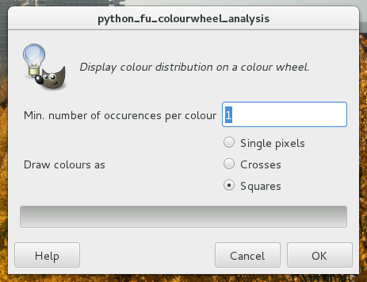
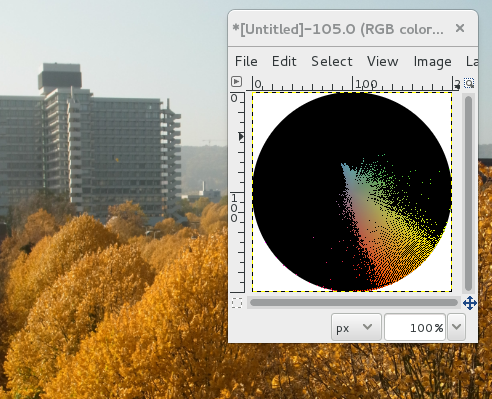
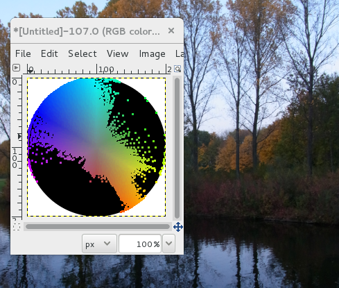

# gimp-colourwheel-analysis

GIMP-Plugin that displays colour distribution on a colour wheel. It
was inpspired by
[James Gurney's thoughts](http://gurneyjourney.blogspot.de/2011/09/part-1-gamut-masking-method.html) on limited palettes and gamut masking.


## Installation

Download [colourwheel_analysis.py](https://raw.githubusercontent.com/rbreu/gimp-colourwheel-analysis/master/colourwheel_analysis.py)
and save it in your plug-ins folder.

On Linux (depending on distro):  `~/.gimp-2.8/plug-ins/`

On Mac: `$HOME/Library/Application Support/Gimp/2.8/plug-ins/`

On Windows: Find your GIMP installation folder (commonly in `Program
Files`), then `lib\gimp\2.8\plug-ins\`

On Linux and Mac, make sure to give the file executable rights:

```
$ chmod +x /path/to/colourwheel_analysis.py
```

Then **restart GIMP**.


## Examples and Usage

Note that only hue and saturation are taken into account; differences
in lightness will be ignored. You can choose how many times a
hue/saturation combination has to occur within the source image before
it gets displayed in the result. Furthermore, you can choose how
results are displayed on the output colour wheel.



Output as pixels:



Output as squares:




## For Developers

The plugin is written in Python. There are unit tests that cover the GIMP-independent calculations. To run them, you need to install pytest, then place both `colourwheel_analysis.py` and `test_colourwheel_analysis.py` in the same folder, preferrably not in your plug-ins folder. Run the tests in that folder with:

```
$ py.test
```